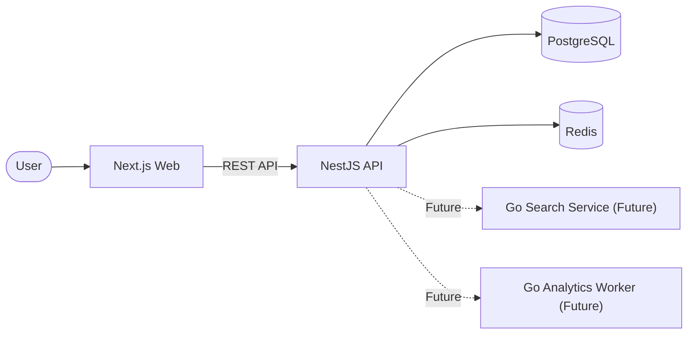
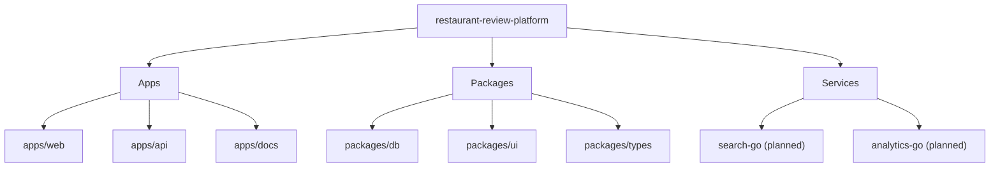
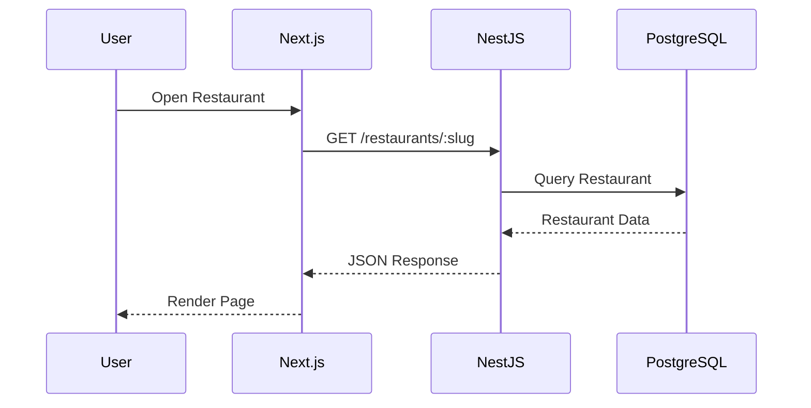
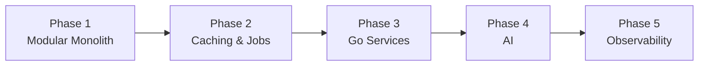
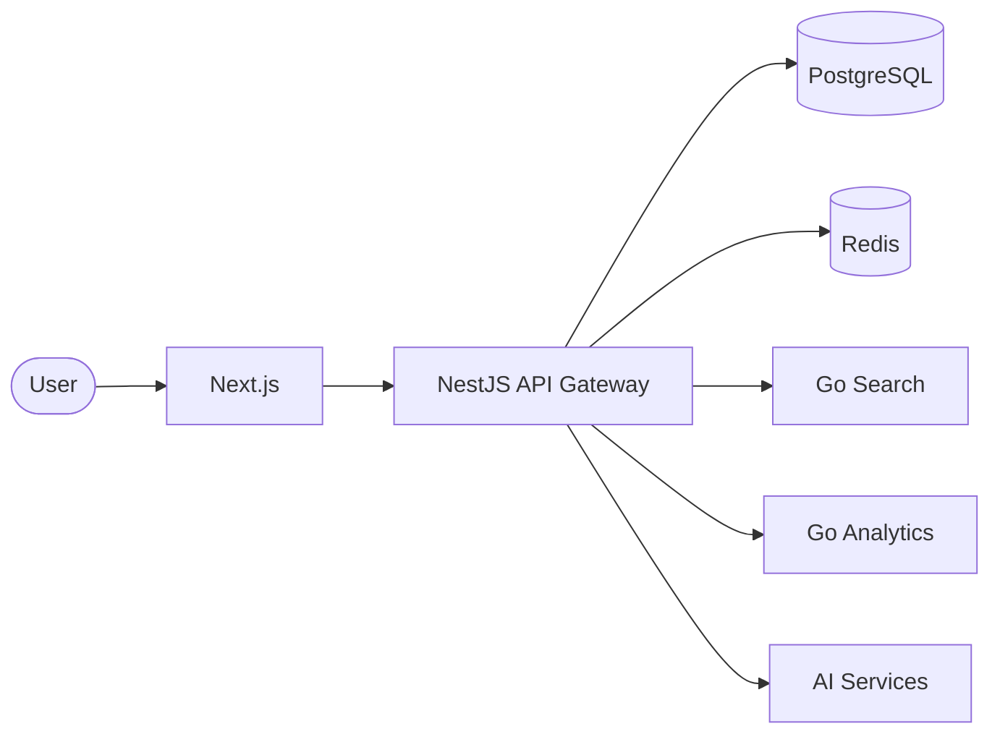

# Architecture Overview

## Overview

The Restaurant Review Platform is designed as a **modular monorepo** that evolves alongside the project.

It begins as a well-structured full-stack application and progressively introduces distributed services as new architectural requirements emerge.

Rather than adopting a microservices architecture from day one, the project follows a **modular-first** approach. Features are initially implemented within a NestJS modular monolith and are extracted into independent services only when they provide meaningful architectural or operational benefits.

This keeps the project simple during its early stages while demonstrating how production systems evolve over time.

---

## High-Level Architecture

---

## Monorepo Structure

---

## Responsibilities

| Component                 | Responsibility                                  |
| ------------------------- | ----------------------------------------------- |
| **apps/web**              | Customer-facing Next.js application             |
| **apps/api**              | NestJS REST API, business logic, authentication |
| **apps/docs**             | Engineering documentation                       |
| **packages/db**           | Prisma schema and database client               |
| **packages/ui**           | Shared UI components                            |
| **packages/types**        | Shared TypeScript types                         |
| **services/search-go**    | High-performance search service (future)        |
| **services/analytics-go** | Analytics and background processing (future)    |

---

## Request Lifecycle

A typical request flows through the following components.

---

## Architectural Principles

This project follows several engineering principles.

- Build simple solutions before introducing complexity.
- Prefer a modular monolith before adopting microservices.
- Keep services independently deployable.
- Share code through packages rather than duplication.
- Document architectural decisions throughout the project.
- Introduce new technologies only when they solve a real engineering problem.

---

## Why NestJS?

NestJS acts as the orchestration layer for the platform.

Its responsibilities include:

- Authentication
- Authorization
- Request validation
- Business logic
- Database access through Prisma
- API documentation
- Communication with future services

Keeping these concerns centralized provides a consistent API while allowing specialized services to evolve independently.

---

## Why Go?

Go will be introduced incrementally rather than replacing the existing backend.

Future services include:

- Search
- Analytics
- Image processing
- Background workers

This demonstrates a pragmatic polyglot architecture where each technology is selected for the problems it solves best.

---

## Evolution Strategy

The architecture evolves in stages.

Each phase builds upon the previous one, allowing architectural complexity to increase only when it provides clear value.

---

## Future Architecture

The long-term goal is to evolve into a service-oriented platform while keeping NestJS as the primary orchestration layer.

This allows individual services to scale independently while maintaining a single, consistent API for clients.
