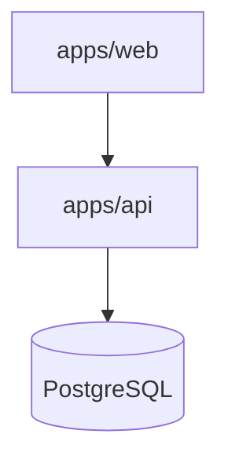

# Architecture

Placeholder content. This section will describe the system architecture,
service boundaries, and data flow across the monorepo's apps and packages.

Diagrams can be added with [Mermaid](https://mermaid.js.org), which Nextra
renders out of the box from a fenced `mermaid` code block:

