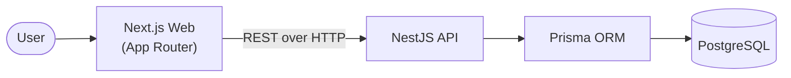
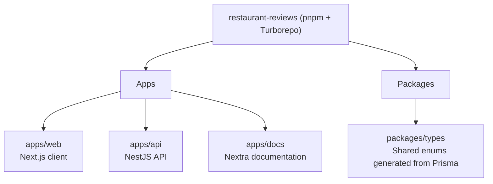
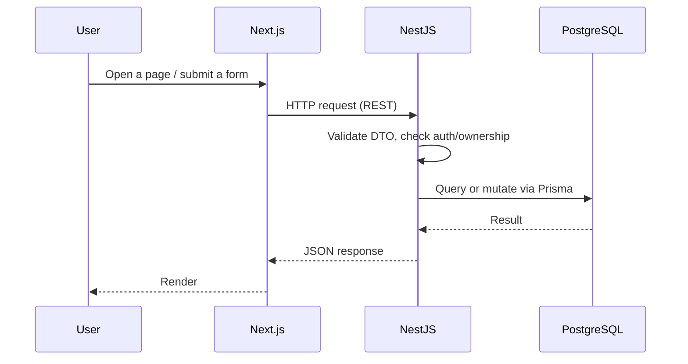

# Current Architecture

This page describes what is implemented in the repository today. It intentionally excludes planned services and future direction — see [Target Architecture](/architecture/target) for that.

---

## High-Level Architecture



Two independently deployable applications share a single PostgreSQL database. `apps/web` never talks to Postgres directly — all data access goes through the `apps/api` REST API.

---

## Monorepo Structure



`packages/types` is the only package shared between applications. It exports the `Cuisine` and `Role` enums generated from `apps/api/prisma/schema.prisma`, so the frontend and backend can't drift out of sync on those values — without bundling the Prisma runtime into the Next.js app.

---

## Request Lifecycle (Summary)



This is a simplified view. Concrete walkthroughs — opening a restaurant page, creating a review, authenticating a user — are covered in detail on the [Request Lifecycle](/architecture/request-lifecycle) page.

---

## Component Responsibilities

| Component      | Responsibility                                                                                     |
| -------------- | --------------------------------------------------------------------------------------------------- |
| **Next.js**    | Presentation layer. App Router with Server Components by default; Client Components for interactive UI (forms, dialogs, filters). No client-side data-fetching library — data is fetched via Server Components or direct calls to the API. |
| **NestJS**     | Business logic and orchestration. Feature-based modules (`auth`, `restaurants`, `reviews`, `users`), each with controllers, services, DTOs, and guards. Owns authentication, authorization, and validation. |
| **PostgreSQL** | System of record. A single database, owned exclusively by `apps/api`. Hosted as an external managed instance (e.g. Neon); reachable only via `DATABASE_URL` on the API service. |
| **Prisma**     | ORM and schema source of truth. `apps/api/prisma/schema.prisma` defines the data model and drives two generators: the API's full Prisma client, and the enum-only client consumed by `packages/types`. |
| **Turborepo**  | Monorepo task orchestration. Ensures `packages/types` is built before any app that imports it, and scopes `build`/`test`/`lint`/`typecheck` per package via `pnpm --filter`. |

---

## Backend Structure

The NestJS application is organized by feature rather than by technical layer:

```text
auth/
restaurants/
reviews/
users/
```

Each module contains its own controller (REST endpoints), service (business rules), DTOs (request validation), and guards where relevant. Ownership checks (e.g. "does this user own this restaurant?") are performed inside the service layer rather than in guards, since ownership depends on the specific resource being requested, not just the caller's role.

## Frontend Structure

```text
app/           route definitions, Server Components, layouts
features/      restaurant / review / auth feature modules
components/    reusable UI
lib/           API client, utilities
```

Restaurant listing and detail pages render as Server Components for faster initial load and better SEO. Interactive elements — dialogs, forms, pagination, filters — are Client Components.

## Authentication and Authorization

Authentication uses short-lived JWT access tokens and longer-lived refresh tokens, both stored as HTTP-only cookies. Refresh tokens are rotated on every refresh request and stored as Argon2 hashes, so a stolen refresh token stops working the next time the legitimate client refreshes.

Two roles exist: **Reviewer** and **Owner**. Authorization is enforced with `JwtAuthGuard`, `RolesGuard`, and explicit ownership checks in services — always on the backend, never assumed from client state.

## What's Deliberately Not Here

To keep this page accurate to the current implementation, it's worth being explicit about what doesn't exist yet: there is no cache layer, no background job queue, no search service, no analytics service, and no AI-powered feature. Diagrams and reasoning for those are on the [Target Architecture](/architecture/target) page.
