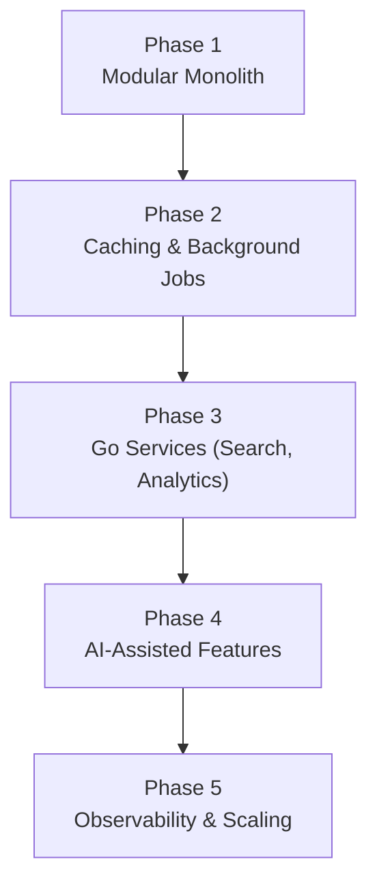

# Architecture Overview

This section documents how the Restaurant Review Platform is built today, where it is headed, and how a request moves through the system. It is split into three pages so that each can be read independently:

- **[Current Architecture](/architecture/current)** — what exists in the codebase right now.
- **[Target Architecture](/architecture/target)** — the long-term direction and the reasoning behind it.
- **[Request Lifecycle](/architecture/request-lifecycle)** — how individual requests flow through the current system.

This page covers the philosophy that connects the three: why the system is built incrementally, and what has to be true before new complexity is justified.

---

## Project Philosophy

The platform starts as a well-structured full-stack application rather than a distributed system. Structure that matters — clear module boundaries, typed contracts between frontend and backend, documented decisions — is put in place from the beginning. Infrastructure that doesn't yet solve a real problem — additional services, message queues, dedicated data stores — is deferred until it does.

This is a deliberate ordering, not a shortcut. Splitting a system into services before its boundaries are well understood tends to produce distributed complexity without the benefits that motivated the split in the first place — extra network hops and operational surface, but no gain in scalability, reliability, or team autonomy.

## Modular Monolith Approach

The backend is a single NestJS application organized by feature module (`auth`, `restaurants`, `reviews`, `users`), each with its own controller, service, and DTOs. This gives the codebase most of the organizational benefit of separate services — clear ownership, isolated business logic — without the operational cost: one deployable, one database connection pool, one set of environment variables, transactions that don't need to cross a network boundary.

Modules are the unit of extraction if and when a service boundary is warranted. A module that has a distinct scaling profile, a different technology fit, or a different release cadence than the rest of the application is a candidate to become its own service. Until one of those is true for a given module, keeping it in the monolith is the simpler and more correct choice.

## Why Not Microservices from Day One

Microservices solve organizational and scaling problems: independent deployability for large teams, independent scaling for workloads with very different resource profiles, fault isolation between unrelated subsystems. None of those problems exist yet for this project — there is one team and one deployment cadence, and no component has demonstrated a scaling profile different from the rest.

Adopting a service-oriented architecture before those problems exist would mean paying for distributed transactions, service discovery, and inter-service contracts up front, in exchange for flexibility the project doesn't need yet. The architecture is expected to grow into services — see [Target Architecture](/architecture/target) — but only as specific, identifiable needs emerge.

## Engineering Principles

- Build the simple version first; add complexity only when it solves an observed problem.
- Prefer a modular monolith to microservices until a module's requirements diverge from the rest of the system.
- Keep any extracted service independently deployable — a service that can't be deployed on its own isn't providing isolation.
- Share code through packages, not through duplication or tight coupling between apps.
- Record architectural decisions as they're made, not retroactively.
- Adopt new technology because it addresses a specific requirement, not because it is available.

## Architecture Evolution

The system is expected to move through the following stages. Each stage is additive: it builds on the previous one rather than replacing it, and a stage is only entered once the previous one is stable.

- **Phase 1 — Modular Monolith.** Where the project is today: a NestJS API and Next.js client sharing one PostgreSQL database. See [Current Architecture](/architecture/current).
- **Phase 2 — Caching & Background Jobs.** Introduce a cache and a job queue once specific endpoints or workflows need them (e.g. expensive reads, asynchronous work that shouldn't block a request).
- **Phase 3 — Go Services.** Extract standalone services (search, analytics) once their workload profile — read-heavy, compute-heavy, or otherwise distinct — justifies a separate runtime.
- **Phase 4 — AI-Assisted Features.** Layer in AI-powered functionality (e.g. review summarization, recommendation) behind the same NestJS orchestration layer.
- **Phase 5 — Observability & Scaling.** Formalize monitoring, tracing, and scaling strategy once there is production traffic to observe.

Details on why each future service exists, and how it fits alongside the current backend, are in [Target Architecture](/architecture/target).
