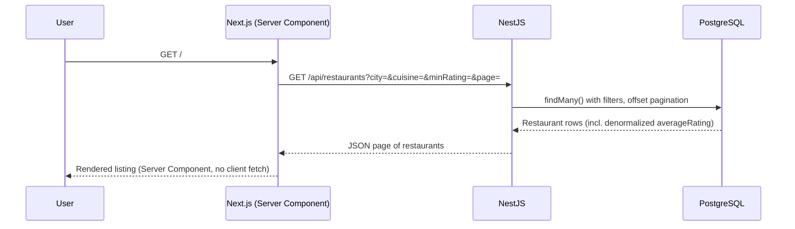
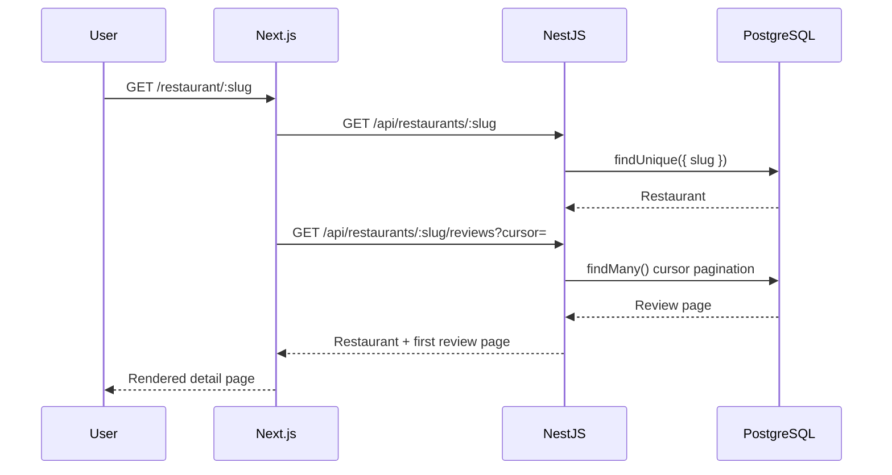
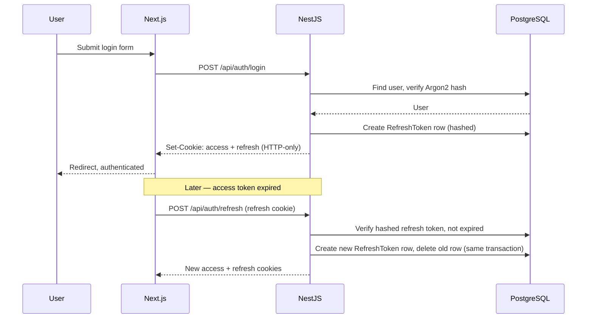

# Request Lifecycle

<Callout type="info">**Status:** ✅ Implemented — these flows match the current codebase.</Callout>

[Current Architecture](/architecture/current) gives the summarized version of
this diagram. This page walks through four concrete requests end to end.

## Browsing the restaurant listing



Filters are read from the URL query string, which is the source of truth
while navigating; they're also mirrored to `localStorage` so they persist
across visits with no query parameters. See
[Features: Search](/features/search) and [API: Filtering](/api/filtering).

## Opening a restaurant page



## Creating a review

```mermaid
sequenceDiagram
    participant User
    participant Web as Next.js (Client Component)
    participant API as NestJS
    participant Guard as JwtAuthGuard + RolesGuard
    participant DB as PostgreSQL

    User->>Web: Submit review form
    Web->>API: POST /api/restaurants/:slug/reviews (cookies)
    API->>Guard: Validate JWT, require REVIEWER role
    Guard-->>API: Authorized
    API->>API: Validate DTO (rating, comment)
    API->>DB: Check for existing review (restaurantId, reviewerId)
    DB-->>API: None found
    API->>DB: Create review; recompute restaurant averageRating/reviewCount
    DB-->>API: Updated rows
    API-->>Web: 201 Created
    Web-->>User: Optimistic UI update
```

A second review from the same reviewer for the same restaurant is rejected
by the `@@unique([restaurantId, reviewerId])` constraint — see
[Features: Reviews](/features/reviews).

## Login and token refresh



Creating the new session before deleting the old one means a crash mid-
rotation leaves the user with a still-valid session rather than zero valid
sessions. See [Features: Authentication](/features/authentication).
