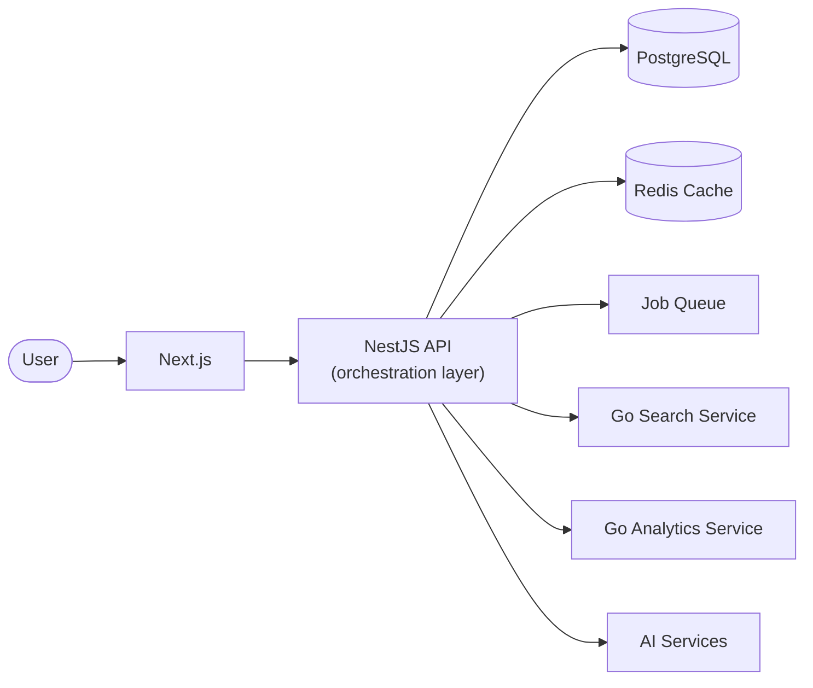
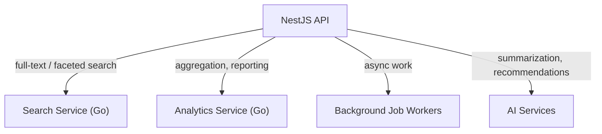

# Target Architecture

This page describes where the architecture is headed, and why. Nothing on this page is implemented yet — for what exists today, see [Current Architecture](/architecture/current). For the reasoning behind moving incrementally rather than building this upfront, see the [Architecture Overview](/architecture).

---

## Future Architecture

NestJS remains the single entry point for clients in every version of this diagram. New services sit behind it, not beside it — the web app continues to talk to one API, regardless of how many services fulfill that API's requests internally.

## Future Services

### Search

Restaurant listing currently supports filtering by city, cuisine, and minimum rating directly against PostgreSQL — sufficient for the current dataset size. A dedicated search service becomes worth building once query patterns need full-text search, ranking, or faceting that a relational database handles poorly at scale.

### Analytics

Aggregate reporting (e.g. trends across restaurants, reviewers, or time) is a different workload from the transactional queries the API serves today: read-heavy, tolerant of slightly stale data, and better served by a data model optimized for aggregation rather than the normalized transactional schema. A separate analytics service lets that workload scale and evolve without affecting the API's request path.

### Background Jobs

Some work doesn't belong in the request/response cycle — for example, recalculating denormalized aggregates in bulk, sending notifications, or processing uploaded content. A job queue lets that work happen asynchronously without holding up the user-facing request that triggered it.

### AI

Planned AI-assisted features (e.g. review summarization or recommendation) are speculative and not yet scoped in detail. They're included here because they inform one architectural constraint: AI calls are typically higher-latency and higher-cost than a database query, which argues for isolating them behind their own service boundary rather than calling them inline from core request paths.

---

## Guiding Constraints

- **NestJS remains the orchestration layer.** Clients never call Search, Analytics, or AI services directly — NestJS remains the single API surface and is responsible for authentication, authorization, and composing responses from whichever services fulfill them.
- **Go services are introduced only when they provide clear architectural value.** A workload becomes a candidate for extraction when it has a distinct performance profile, scaling requirement, or technology fit that the NestJS monolith doesn't serve well — not on a fixed schedule.
- **The project evolves incrementally.** Each service in this document is added once [Current Architecture](/architecture/current) demonstrates a concrete need for it, following the stages described in the [Architecture Overview](/architecture). This page describes direction, not a committed timeline.
