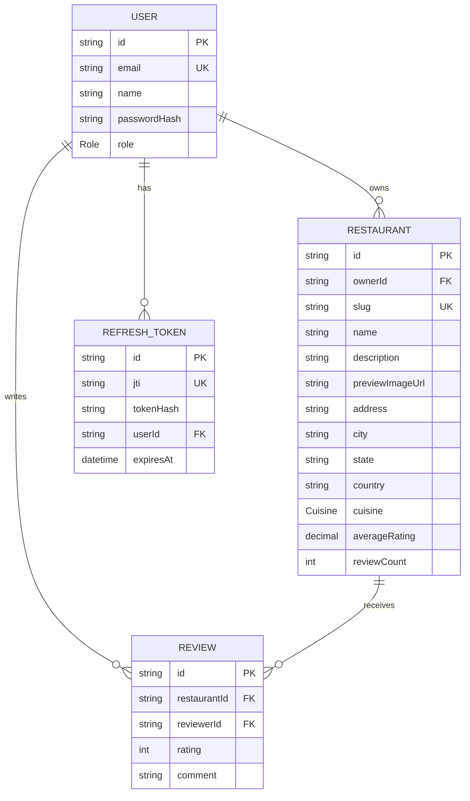

# ER Diagram

<Callout type="info">**Status:** ✅ Implemented — generated from `apps/api/prisma/schema.prisma`.</Callout>

Four models only — there is no `Favorite`, `Notification`, or `Reservation`
table yet (see [Features](/features) for the status of each). `Review` has a
compound unique constraint on `(restaurantId, reviewerId)`, so the ER
relation "Restaurant receives Reviews" is capped at one review per
`(restaurant, reviewer)` pair rather than truly unbounded.
