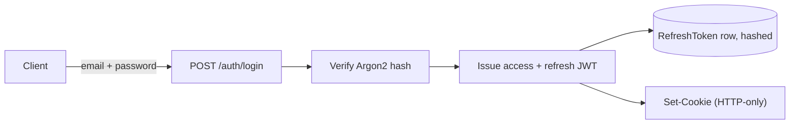

# Authentication

<Callout type="info">**Status:** ✅ Implemented</Callout>

## Overview

Users authenticate with email + password. The API issues a short-lived JWT
access token and a longer-lived refresh token, both set as HTTP-only cookies.

## Purpose

Session-based auth (server-side session store) would work too, but cookies
carrying signed, stateless JWTs mean the API doesn't need a session store —
only a `RefreshToken` table for the pieces that must be revocable.

## Architecture

See [Request Lifecycle: Login and token refresh](/architecture/request-lifecycle#login-and-token-refresh)
for the full sequence including rotation.

## Implementation

- **Access token** — 15-minute lifetime, signed with `JWT_SECRET`.
- **Refresh token** — 7-day lifetime, signed with `JWT_REFRESH_SECRET`,
  stored server-side as an Argon2 **hash** in `RefreshToken` (never the raw
  token) so a database read alone can't produce a usable session.
- **Rotation** — every `/auth/refresh` call creates a new `RefreshToken` row
  first, then deletes the old one, in the same transaction. Creating before
  deleting means a crash mid-rotation leaves a valid session rather than
  none.
- Storing refresh tokens in their own table (rather than on `User`) allows
  multiple concurrent sessions, per-device logout (`/auth/logout`), and
  logout-everywhere (`/auth/logout-all`).

### Database

`RefreshToken` — see [ER Diagram](/database/er-diagram): `jti` (unique),
`tokenHash`, `userId`, `expiresAt`, indexed on `userId` and `expiresAt`.

### API

`/auth/register`, `/auth/login`, `/auth/me`, `/auth/refresh`, `/auth/logout`,
`/auth/logout-all` — full contract on [API: Authentication](/api/authentication).

### Security

- Argon2 for both password hashes and refresh-token hashes.
- Cookies: `HttpOnly`, `secure` in production, `sameSite: lax`.
- `/auth/register` and `/auth/login` are rate-limited (5 requests/minute)
  separately from the global rate limit, to slow brute-force attempts.

## Trade-offs

- Rotation adds a write on every refresh (new row + delete) instead of
  reusing one row — accepted for the security benefit of invalidating stolen
  tokens on next legitimate use.
- No "remember me" / variable-length sessions — refresh lifetime is fixed at
  7 days for every login.

## Future Improvements

- Widening CORS/cookie handling to support Vercel preview deployments (today
  only the pinned production origin is allowed — see
  [Environment Strategy](/infrastructure/environment-strategy)).
- OAuth/social login is not on the current roadmap.

## References

- `apps/api/src/auth/`
- [Architecture: Backend](/architecture/backend)
- [API: Authentication](/api/authentication)
