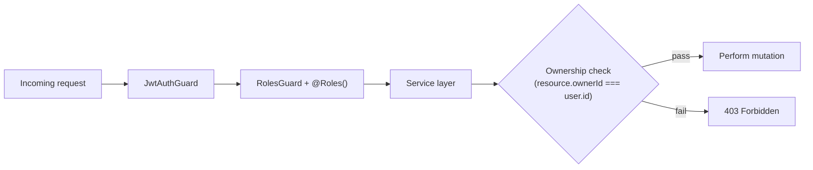

# Authorization

<Callout type="info">**Status:** ✅ Implemented</Callout>

## Overview

Two roles: `REVIEWER` and `OWNER`, chosen at registration and immutable
afterward. Roles gate *which endpoints* a user can call; ownership checks
gate *which specific resources* they can modify.

## Purpose

A role alone can't answer "can this user edit *this* restaurant?" — that
depends on who owns the specific row being requested, which is only known
once the resource is loaded. Splitting the check this way keeps guards
simple (role-only) and puts resource-specific logic where the resource is
already being fetched.

## Architecture

## Implementation

- `JwtAuthGuard` — requires a valid access token.
- `RolesGuard` + `@Roles(Role.OWNER)` / `@Roles(Role.REVIEWER)` — requires
  the token's role to match.
- Ownership is checked inside the service (e.g.
  `RestaurantsService.update(userId, id, dto)` loads the restaurant and
  compares `ownerId` before mutating), never assumed from client-supplied
  state.

### Database

No dedicated table — `Role` is a Prisma enum on `User`; ownership is the
`ownerId` foreign key on `Restaurant` and `reviewerId` on `Review`.

### API

Every mutating restaurant/review endpoint requires both the matching role
and passes an ownership check — see [API: Error Handling](/api/error-handling)
for the resulting status codes (`403` on role/ownership failure).

### Security

Authorization decisions are made exclusively on the backend. The frontend
may hide UI for a role it doesn't expect, but that's a UX convenience, not a
security boundary.

## Trade-offs

- Only two roles, no fine-grained permission system — sufficient while the
  feature set is small; would need revisiting if a third role (e.g. admin)
  is introduced.
- Role is immutable post-registration by design, to avoid privilege-escalation
  edge cases; there's no admin tooling to change it either.

## Future Improvements

- No planned changes; would be revisited if the product needs more than two
  roles.

## References

- `apps/api/src/auth/guards/`, `apps/api/src/auth/decorators/roles.decorator.ts`
- [Architecture: Backend](/architecture/backend)
