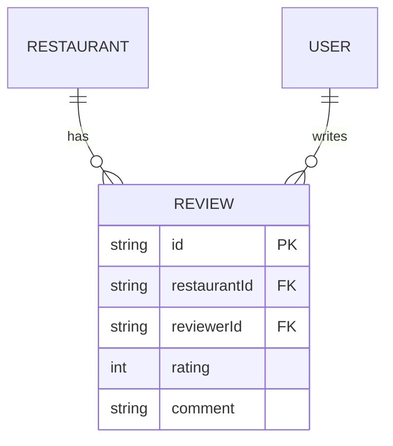

# Reviews

<Callout type="info">**Status:** ✅ Implemented</Callout>

## Overview

Reviewers rate and comment on restaurants — exactly one review per
restaurant per reviewer, enforced at the database level.

## Purpose

The one-review-per-reviewer rule keeps `averageRating` meaningful (no user
can weight a restaurant's score by posting repeatedly) and simplifies the
UI: a reviewer either creates or edits their single review, never chooses
among several.

## Architecture

`@@unique([restaurantId, reviewerId])` is what makes "one review per
reviewer" a database guarantee rather than an application-level check that
could race.

## Implementation

### Database

`Review` — `rating` (int), `comment`, `restaurantId`, `reviewerId`, unique
on `(restaurantId, reviewerId)`, indexed on both foreign keys individually
too (for listing a restaurant's reviews, and a user's reviews).

### API

- `GET /restaurants/:slug/reviews` — public, **cursor**-paginated.
- `POST /restaurants/:slug/reviews` — `REVIEWER` role required.
- `PATCH /reviews/:id`, `DELETE /reviews/:id` — `REVIEWER` role + ownership
  (only the authoring reviewer).

Full contract: [API: Pagination](/api/pagination).

### Frontend

Review list and form live under `features/reviews/`; the list uses a
"Load More" pattern matching cursor pagination rather than numbered pages.

### Backend

`ReviewsController` / `ReviewsService` in `apps/api/src/reviews/`. On
create/update/delete, the service recomputes the parent restaurant's
`averageRating` and `reviewCount` in the same operation.

### Security

Only the authoring reviewer can edit or delete their review — checked in
`ReviewsService`, same pattern as restaurant ownership.

### Performance

Cursor pagination is used here instead of offset (used for restaurants)
because review lists are potentially unbounded and read with a "Load More"
UX — cursor pagination avoids the correctness and performance problems
offset pagination has on deep, frequently-appended lists. See
[API: Pagination](/api/pagination) for the full comparison.

## Trade-offs

- The unique constraint means "edit your review" and "leave a new review"
  are the same action from the user's perspective — the UI has to route
  this correctly rather than always presenting a "create" form.

## Future Improvements

- None currently planned beyond what's tracked in
  [Roadmap](/roadmap) at the platform level (e.g. AI-generated review
  summaries — see [Features: AI](/features/ai)).

## References

- `apps/api/src/reviews/`
- [Database: ER Diagram](/database/er-diagram)
