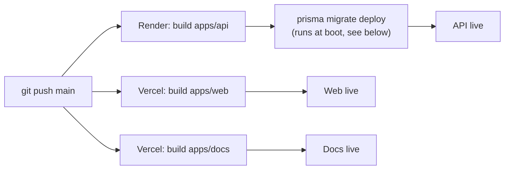

# Deployment

<Callout type="info">**Status:** ✅ Implemented</Callout>

## Why build order matters

Both `apps/api` and `apps/web` depend on `packages/types`, which depends on
Prisma-generated code owned by `apps/api`. Every build must run, in order:
`prisma generate` (from `apps/api`) → build `packages/types` → build the
target app.

- **Render** (`render.yaml`):
  `pnpm --filter api exec prisma generate && pnpm --filter types build && pnpm --filter api build`
- **Vercel** (`apps/web/vercel.json`): since Vercel's Root Directory is
  `apps/web`, the build command `cd`s back to the repo root first, then runs
  the same sequence scoped to `web` and its dependencies via
  `pnpm turbo run build --filter=web...`.

## Migrations on Render's free tier

Render's Pre-Deploy Command feature isn't available on the free plan, so
`prisma migrate deploy` runs at the front of `startCommand` instead, right
before `node dist/main`. Safe on every boot since it's a no-op when nothing
is pending. Full detail: [Database: Migrations](/database/migrations).

## A build-output gotcha worth knowing

`apps/api/tsconfig.build.json` explicitly excludes `prisma.config.ts` and
`prisma/`, and pins `rootDir: "./src"`. Without that, TypeScript infers
`rootDir` as the package root (since `prisma.config.ts` lives outside
`src/`), and `nest build` nests output under `dist/src/main.js` instead of
`dist/main.js` — breaking `node dist/main` at deploy time with no compile
error pointing at the cause. `prisma.config.ts` doesn't need compiling
anyway; Prisma's CLI loads it directly from source.
