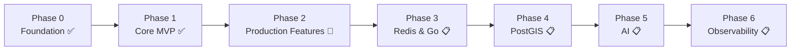

# Roadmap Overview

Each phase is additive — it builds on the previous one rather than
replacing it, and a phase is only entered once the previous one is stable.
See [Architecture: Evolution Strategy](/architecture#architecture-evolution)
for the reasoning behind moving incrementally.

| Phase | Status | Summary |
| --- | --- | --- |
| [0 — Foundation](/roadmap/phase-0-foundation) | ✅ Complete | Monorepo, shared types, base app scaffolding |
| [1 — Core MVP](/roadmap/phase-1-core-mvp) | ✅ Complete | Auth, authorization, restaurant + review CRUD |
| [2 — Production Features](/roadmap/phase-2-production-features) | 🚧 In Progress | Rate limiting/security hardening done; favorites, real uploads, search, notifications, reservations pending |
| [3 — Redis & Go Services](/roadmap/phase-3-redis-go-services) | 📋 Planned | Caching, background jobs, search/analytics services |
| [4 — PostGIS & Geospatial Search](/roadmap/phase-4-postgis-geospatial-search) | 📋 Planned | Location-based discovery |
| [5 — AI & Semantic Search](/roadmap/phase-5-ai-semantic-search) | 📋 Planned | pgvector, recommendations, summaries |
| [6 — Observability](/roadmap/phase-6-observability) | 📋 Planned | Metrics, logging, tracing, monitoring |

See [Future Ideas](/roadmap/future-ideas) for items not yet assigned to a
phase.
